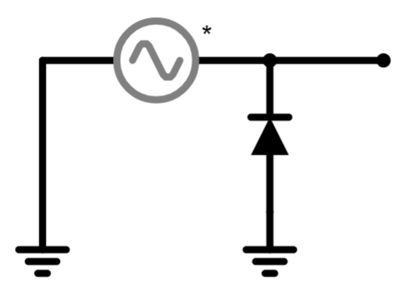

# Diode Clipping
## Definition
Diode clipping is technique that was developped in order to mimic the distortion that happenned to andio signals when amps would reach their maximum levels and signal loss would occur in the for of clipping where the signal would be cut off at its extremities.
Diode clipping is a sort signal modulation that has the following caracteristics :

```
  - Limits the maximum and minimum values that the signal can hold
  - Is created in circuits using TVS Diodes and amplifier methods 
```

## Caracteristics
<i align="center">

</i>
## Polarity
## Symetry
## Placement
