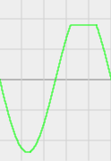
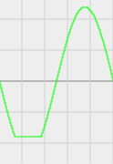

# Diode Clipping
## Definition
Diode clipping is a signal processing technique used in electronic circuits to intentionally introduce distortion to audio signals, simulating the effects of natural clipping that occurs when amplifiers reach their maximum levels. Clipping a signal is when you purposely don’t let it reach the nominal maximum that it can. This technique is commonly employed in electric guitar amplifiers and other audio processing equipment to achieve a specific and desirable sound characteristic.

Diode clipping is a sort signal modulation that has the following caracteristics :

```
  - Limits the maximum and minimum values that the signal can hold
  - Is created in circuits using TVS Diodes and amplifier methods 
```

## Caracteristics

<i align="center">
  


</i>

## Polarity
The unidirectional nature of diodes plays a crucial role in their application for clipping in electronic circuits. Diodes allow current to flow in one direction only, from the anode to the cathode, and they have a specific forward voltage drop.
In diode clipping circuits, diodes are often arranged in such a way that they allow current to flow only when the voltage across them is in the forward bias direction. This characteristic helps in shaping or "clipping" the input waveform by limiting its amplitude.

Understanding the direction (polarity) in which the diode is placed is crucial for designing diode clipping circuits and determining whether positive or negative portions of the input signal will be clipped. This unidirectional behavior of diodes is fundamental to their role in shaping waveforms in electronic applications.

There are two common types of diode clipping configurations:

### Positive Clipper:

In this configuration, the diode is oriented to allow current flow during the positive half-cycle of the input signal. If the voltage across the diode exceeds its forward voltage drop during the positive half-cycle, the diode becomes forward-biased, allowing current to flow and resulting in positive clipping.

<i align="center">
  
  

</i>

### Negative Clipper:

In this configuration, the diode is oriented to conduct during the negative half-cycle of the input signal.If the voltage across the diode exceeds its forward voltage drop during the negative half-cycle, the diode becomes forward-biased, allowing current to flow and resulting in negative clipping.

<i align="center">
  


</i>

## Symetry

Symmetry, as a characteristic in diode clipping circuits, plays a pivotal role in shaping the balance and contour of waveforms. This characteristic encompasses the intentional arrangement of components to either create an even and uniform response in both positive and negative excursions of the input signal, or to deliberately introduce imbalances for asymmetrical distortion profiles.

### Symmetrical Clipping
Symmetrical clipping involves the deployment of even pairs of identical diodes, creating a balanced response in both directions of the input signal. In a symmetrical clipping configuration:

A single symmetrical clipper often employs a pair of diodes, with one diode facilitating current flow during the positive half-cycle and the other during the negative half-cycle. The response is well-balanced, ensuring that both positive and negative excursions of the input signal undergo similar clipping characteristics. Dual symmetrical clippers may utilize two pairs of diodes in series, resulting in softer clipping due to the cumulative forward voltage drop factor. Symmetry in diode clipping allows for precise control and even distortion on both sides of the waveform, creating harmonically rich tones.

### Asymmetrical Clipping
Asymmetrical clipping introduces intentional imbalances in diode arrangement, leading to distinct clipping characteristics in different directions of the input signal. In an asymmetrical clipping configuration:

Odd sets of diodes or an additional diode on one directional path are employed, causing varying degrees of clipping on either side of the center line. Commonly, this involves using two diodes on one path and one diode in the opposite direction, creating an intentional imbalance in clipping behavior. Alternatively, designers may use different diodes with distinct forward voltage (Vf) values to achieve the desired asymmetry. Asymmetry provides a means to tailor the distortion response to be different in positive and negative signal excursions.

## Placement
### Hard Clipping Circuit:
In a hard clipping circuit, diodes are typically used to shunt the signal to ground when it exceeds a certain threshold. The most straightforward configuration involves placing diodes in an arrangement that allows them to conduct and short the signal to ground when it reaches a specific voltage level. The circuit often looks like this:

Key features of hard clipping include:
- Abrupt Cutoff: When the input signal surpasses the threshold (typically the Vf of diodes), the waveform is sharply cut off. This results in a more square-like waveform, creating a distinct and pronounced distortion.

- Rich in Odd Harmonics: Hard clipping generates a sound rich in odd harmonics. The abrupt nature of the clipping process introduces harmonic content that is primarily odd multiples of the fundamental frequency, contributing to a harsher and grittier tonal character.

- Aggressive Distortion: Hard clipping is often associated with more aggressive distortion characteristics, making it suitable for genres and musical styles where a raw and intense sound is desired.

### Soft Clipping Circuit:
Soft clipping is often achieved by incorporating diodes into a feedback loop, typically within an amplifier stage. This allows for a smoother transition into distortion as the input signal approaches the clipping threshold. A common configuration is as follows:

Key features of soft clipping include:
- Gradual Saturation: Soft clipping introduces a gradual saturation effect as the signal nears the clipping threshold. This produces a smoother, more rounded waveform compared to the abrupt cutoff of hard clipping.

- Rich in Even Harmonics: Soft clipping tends to generate more even harmonics in addition to odd harmonics. The gradual compression of the signal contributes to a warmer and smoother tonal quality, often considered more musical.

- Smooth Distortion: Soft clipping is associated with a smoother and more musical distortion, making it suitable for applications where a more subtle or vintage distortion sound is desired.


